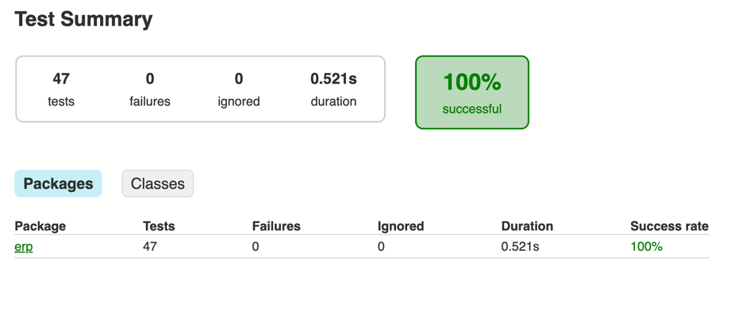
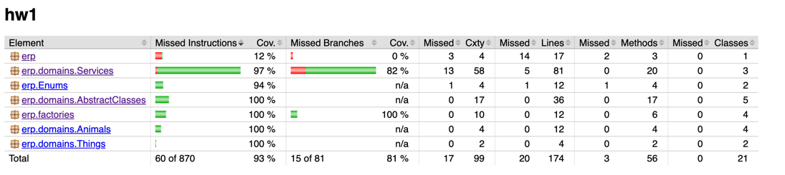

## Консольное ERP-приложение для зоопарка

### Идеи решения

##### Структура классов доменной области

У нас будет два интерфейса: IAlive - живое существо и IInventory - инвентаризационная вещь. Они устроены так же, как описано в условиях. 
Также у нас будут абстрактные классы Animal (имплементирует IAlive и IInventory) и Thing (имплементирует IInventory)

Все классы вещей будут наследоваться от Thing.

От Animal наследуются 3 абстрактных класса для типов животных: Herbo - травоядные, Predator - хищные, Omnivore - всеядные.

В данном случае использование и интерфейсов, и абстрактных классов сразу имеет некоторый смысл: При добавлении нового вида животных мы сможем удобно унаследоваться от одного из трех типов животных и получить сразу все необходимые свойства. Если бы использовали только интерфейсы, то нам пришлось бы каждый раз наследоваться от нескольких интерфейсов, что не так удобно. 
Как известно, с наследованием бывают проблемы при увеличении доменной области. Но в этом случае расширения не предвидится, потому что мы своими абстрактными классами покрыли сразу все виды животных. 

Существующие типы животных и вещей будем хранить в Enum-ах. Для удобного конструирования животных и вещей создадим абстрактные фабрики, опирающиеся на описанные в Enum-ах существующие классы.

Класс VetClinic тоже будет опираться на описанные в Enum-е Animals классы. Для каждого из них установлены свои критерии здоровья, основываясь на которых выносится решение о том, здорово ли животное.
Также Сделан интерфейс IHealthCheck, который реализует VetClinic.

Класс Zoo - класс, который принимает животных и вещи на баланс, хранит их и выводит. 

Класс CommandParser - парсит команды, вводимые пользователем

Класс ConsoleApp - запускает приложение

### Применение принципов ООП и SOLID, а также DI-контейнера

- Мы разделили интерфейсы, к которым относятся наши классы (IInventory и IAlive). 
    Таким образом, мы смогли удобно использовать оба этих интерфейса для животных и лишь один из них для вещей. Тут использован принцип разделения интерфейсов (I из SOLID).

- В нашей реализации Zoo зависит от интерфейса IHealthCheck, а не от класса VetClinic. Тут использован принцип инверсии зависимостей (D из SOLID). 

- Принцип подстановки Лисков использован при наследовании абстрактных классов типов животных(травоядное, плотоядное, всеядное) от Animal и видов животных от типов животных (L из SOLID).

- Принцип единственной ответственности использован во всех классах (Например, класс CommandParser занимается только парсингом команд и вызовом методов zoo, но он не пишет и не читает из командной строки) (S из SOLID).

- Для внедрения зависимостей в классах CommandParser, Zoo, ConsoleApp использован DI-контейнер (Spring).

Еще применен паттерн проектирования абстрактная фабрика.

### Допустимые команды 
- add-animal - add thing with given type and properties (type, name, age, food, socialSkills, physicalParams) (example: add-animal Wolf Rex 2 10 7 50); 
- count-food - prints total amount of food that animals need;
- add-thing - add thing with given type (example: add-thing Computer);
- list-animals - prints list of animals in the zoo;
- list-things - prints list of things in the zoo;
- inventory - prints list of inventory subjects in the zoo;
- list-contact-zoo - prints list of animals for contact zoo;
- count-animals - prints total number of animals in the zoo;
- count-things - prints total number of things in the zoo;
- count-inventory - prints total number of inventory subjects in the zoo;
- help - prints available commands;
- stop - shutdown the app.
### Пример последовательности команд
```bash
add-animal Wolf Rex 2 10 7 50
add-animal Wolf Morrison 3 15 8 60
add-animal Wolf Ed 1 5 4 40
add-animal Tiger Sherkhan 6 25 10 10
add-animal Rabbit Cookie 1 5 4 10
add-animal Rabbit Alex 1 7 10 15
add-animal Rabbit Twinkle 1 5 5 5
add-animal Monkey Coco 5 20 -2 60
add-animal Monkey Bob 3 15 2 25
add-thing Computer
add-thing Computer
add-thing Table
add-thing Computer
list-animals
list-things
count-food
list-contact-zoo
stop
```

### Тестирование
#### Отчет о результатах тестирования


#### Отчет о покрытии 

